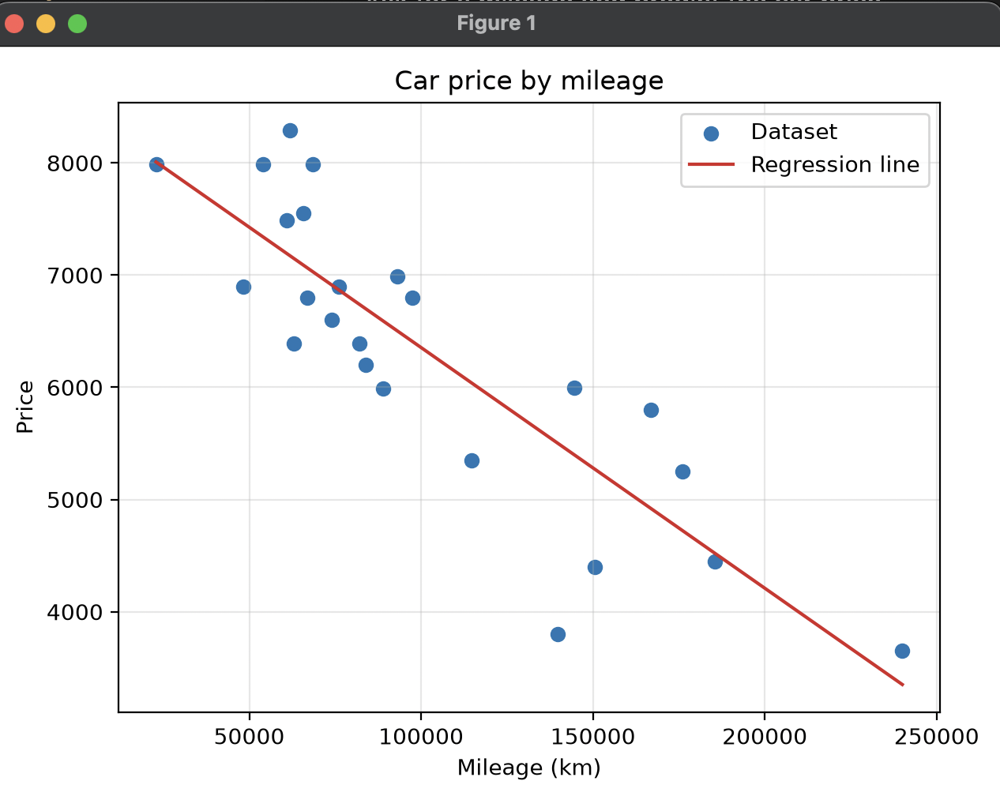
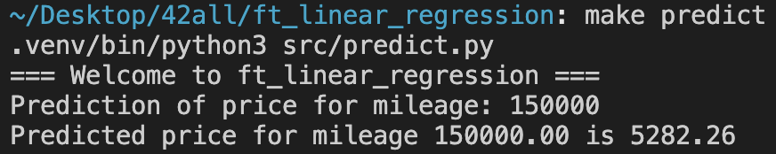

# ft_linear_regression

An introduction to machine learning through simple linear regression.

The goal is to predict a car price from its mileage using the hypothesis given
by the 42 subject:

```text
estimatePrice(mileage) = theta0 + theta1 * mileage
```

The model is trained manually with gradient descent. No library is used to train
the regression model.

## Preview





## Structure

```text
.
├── data/
│   └── data.csv
├── docs/
│   ├── plot.png
│   └── prediction.png
├── model/
│   └── params.json
├── src/
│   ├── train.py
│   ├── predict.py
│   ├── plot.py
│   ├── metrics.py
│   └── utils.py
├── Makefile
├── requirements.txt
└── README.md
```

## Files

- `src/train.py`: trains `theta0` and `theta1` with gradient descent.
- `src/predict.py`: asks for mileage and estimates the car price.
- `src/plot.py`: bonus graph with dataset points and regression line.
- `src/metrics.py`: bonus precision metrics.
- `src/utils.py`: shared helpers for data loading, parameters, and hypothesis.
- `data/data.csv`: training dataset.
- `docs/plot.png`: preview of the plotted data and regression line.
- `docs/prediction.png`: preview of the prediction program.
- `model/params.json`: saved model parameters.

## Commands

```sh
make help
```

Show all available Makefile targets.

```sh
make all
```

Train the model and calculate precision.

```sh
make venv
```

Create the local Python virtual environment.

```sh
make install
```

Create the virtual environment and install dependencies.

```sh
make train
```

Train the model and save learned parameters into `model/params.json`.

```sh
make predict
```

Ask for a mileage and predict the car price.

```sh
make plot
```

Display the dataset and the trained regression line.

```sh
make metrics
```

Display precision metrics.

```sh
make clean
```

Remove Python cache files.

```sh
make fclean
```

Reset generated cache files and set `theta0` and `theta1` back to `0.0`.

```sh
make re
```

Reset the model, then train again.

## Training

The training program starts with:

```text
theta0 = 0
theta1 = 0
```

For each iteration, it computes prediction errors and updates both theta values
simultaneously:

```text
tmp_theta0 = learningRate * 1/m * sum(error)
tmp_theta1 = learningRate * 1/m * sum(error * mileage)
```

Then:

```text
theta0 -= tmp_theta0
theta1 -= tmp_theta1
```

Mileage is normalized during training to keep gradient descent stable. The final
theta values are converted back so prediction still uses raw mileage with the
subject hypothesis.

## Precision

The bonus precision program prints:

- `MAE`: average absolute prediction error.
- `MSE`: average squared prediction error.
- `RMSE`: square root of MSE, easier to read because it is in price units.
- `R2`: how much price variation is explained by the model.
- `MAPE`: average percentage error.

## What I Learned

- How a linear model represents a prediction as `theta0 + theta1 * x`.
- Why gradient descent updates theta values in the opposite direction of the
  error gradient.
- Why features can need normalization when their values are large.
- Why the target value, `price`, is not a feature.
- How MSE, RMSE, MAE, R2, and MAPE describe model error from different angles.
- How to keep training, prediction, plotting, and metrics as separate programs.


`matplotlib` is only used for the bonus plot.
